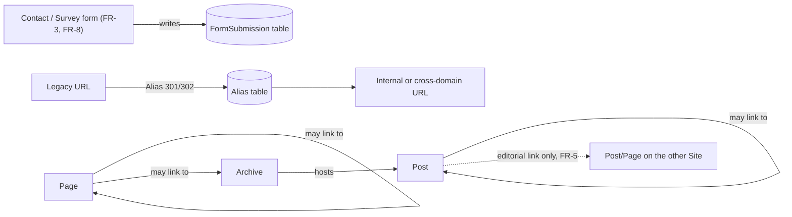
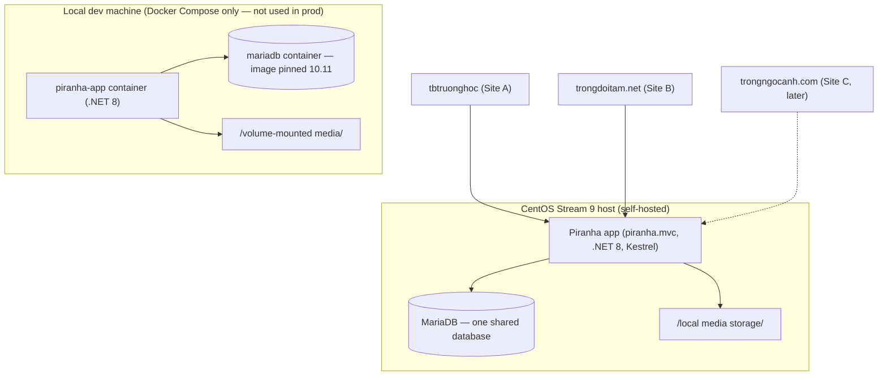
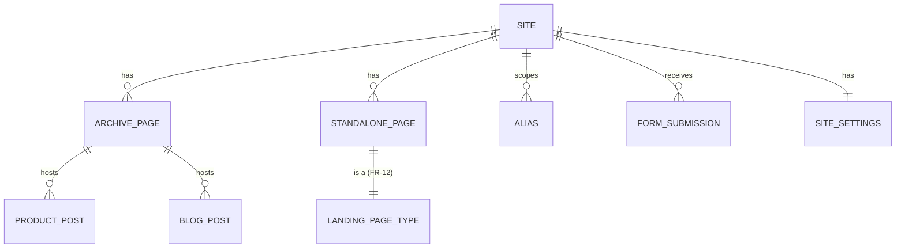

# Architecture Spine — Ngoc Anh Multi-Site Rebuild — Phase 1

## Design Paradigm

One Piranha CMS installation, multi-site: two `Site` records (Site A `tbtruonghoc`, Site B `trongdoitam.net`; Site C to join later as a third), sharing one database, one media library, one Manager login — not two separate deployments.

Within each site, content splits by shape, not by feature:

- **Archive + Post** — anything that is a list or a taxonomy: each danh mục (category) is an Archive page hosting Posts (the products in it); the blog (FR-7/FR-14) is the same Archive+Post mechanism reused, not a second system. This buys native pagination, categories and tags for free.
- **Standalone Page** — anything that stands alone and must never paginate or appear in an archive listing: homepage, the aggregate "Danh mục sản phẩm" hub, landing pages (FR-12), the craftsman/heritage story page (FR-10).

## Invariants & Rules



### AD-1 — Single Piranha instance, native multi-site

- **Binds:** all
- **Prevents:** divergent hosting/ops setups per site, duplicated media libraries, duplicated admin/user management, a future builder standing up a second Piranha deployment for Site C "to be safe"
- **Rule:** Site A and Site B (and later Site C) are `Site` records inside one Piranha installation, one database, one deployment. Do not split into per-site deployments. SEO ranking is per-domain and unaffected by this choice (sitemap/robots/Search Console are already separate per FR-4); the commonly-owned-domain link-scheme risk is mitigated by FR-5's editorial-only cross-linking, not by infrastructure separation. `Site` records (hostnames, `IsDefault`) are created once, by whoever runs the initial project scaffold/setup — never re-derived or re-scaffolded per feature/site builder, and a second Piranha instance must never be spun up "for Site B" even via the official `dotnet new piranha.mvc` quickstart.

### AD-2 — Content shape: Archive+Post vs. standalone Page

- **Binds:** FR-6, FR-7, FR-9, FR-10, FR-12, FR-14
- **Prevents:** one site modeling products as free-standing Pages while the other uses Archive+Post, breaking shared templating/URL conventions and duplicating pagination logic by hand; a hub page silently reintroducing hand-rolled listing logic inside a type nominally exempt from it
- **Rule:** Every danh mục category and the blog are built as an Archive page + Post children. Landing pages, the craftsman story page, the homepage, and the category hub page are standalone Pages, deliberately excluded from any Archive listing. The aggregate "Danh mục sản phẩm" hub page sources its category list dynamically, by querying the site's Archive pages at render time — never a hand-curated or hardcoded link list — matching the UX spec's CMS-flexible list with a placeholder tile for future categories.

### AD-3 — Lead capture: custom storage + Manager extension, not Comments

- **Binds:** FR-3, FR-8
- **Prevents:** forms silently dropping data into an unretrievable email-only channel; each site/form inventing its own storage; customer PII (phone, address) leaking into Piranha's public comment-approval flow; FR-3's and FR-8's builders each inventing an incompatible submission schema
- **Rule:** FR-3 and FR-8 submissions write to **one shared** custom EF Core table in the shared database — never to Piranha's built-in `Comment`/`PostComment` model, which is a fixed-schema (Author/Email/Url/Body), Post-only, publicly-displayed-once-approved blog-comment feature with no phone/address/product fields. Canonical schema, fixed (not a free-form JSON blob, not per-form-type subtables): `id, site_id, form_type, name, phone, product_of_interest, message, location_address (nullable, FR-8 only), is_outside_service_area (bool, nullable), created_at`. A custom Piranha Manager extension module ("Danh sách khách để lại thông tin") lists and details every submission, replacing pen-and-paper tracking. An email notification fires on every new submission. Both submission endpoints are client-side (fetch/AJAX), never a traditional form-post-with-redirect — the UX spec requires the success/error state to replace the form in place (FR-3) or surface inside the modal (FR-8) with no page reload and no cleared field values on failure.

### AD-4 — Redirects via Piranha's native Alias, not custom middleware

- **Binds:** legacy content-migration/redirect plan (addendum.md)
- **Prevents:** a hand-built redirect table/middleware duplicating a mechanism Piranha already ships; inconsistent handling between same-domain and cross-domain redirects; dead redirects from sequencing the migration wrong
- **Rule:** All 301/302 redirects — same-domain (Site A URL restructuring) and cross-domain (legacy trống URLs on tbtruonghoc.com → trongdoitam.net) — use `IApi.Aliases` / `AliasRouter`. `Alias.RedirectUrl` is an unconstrained string, verified to accept absolute external URLs, so both cases use the same mechanism. Every alias is scoped (`SiteId`) to the site where the OLD url lived — Site A for both same-domain and cross-domain-to-Site-B redirects. Cross-domain aliases are created only **after** Site B's final URL/slug structure is frozen — never before — to avoid pointing a live redirect at a Site B URL that later changes.

### AD-5 — Pricing on Product Posts is optional and flexible; Landing Page pricing is structured multi-variant

- **Binds:** FR-9, FR-12, FR-13
- **Prevents:** a builder treating "has a price" and "is a Landing Page" as the same thing (e.g. modeling a catalog product as a Landing Page instance just to show a price, pulling it out of its Archive+Post taxonomy)
- **Rule:** The Product Post Type carries an **optional** price field the content editor may leave blank (pure contact-for-quote) or fill in as an exact value, a range, or a "từ X" starting price. The "Liên hệ báo giá" CTA is always present regardless of whether a price is shown — the two are not mutually exclusive. The Landing Page Type separately carries its own repeatable variant+price region for structured multi-variant paid-campaign pricing (e.g. thùng rượu's 4 variants shown together) — a distinct use case from the single flexible price field on a regular Product Post. A catalog product is never modeled as a Landing Page instance merely to display a price.

### AD-6 — Daily backup of the shared MariaDB database

- **Binds:** all (both sites depend on the one database — AD-1's shared instance is a single point of failure for both at once)
- **Prevents:** one data-loss event destroying Site A and Site B simultaneously with no recovery path
- **Rule:** Automated daily `mariadb-dump` (mysqldump-compatible) backup of the shared database, retained 14 days, stored on the CentOS host.

## Consistency Conventions

| Concern | Convention |
| --- | --- |
| Cross-site linking (FR-5) | A plain hyperlink placed manually by the content editor inside a Post/Page rich-text block. No dedicated link-block component, no automated/sitewide link list — this is what keeps FR-5 from silently becoming a link farm. |
| URL slugs (FR-1) | Human-readable, Vietnamese, editable post-publish without breaking internal links (Piranha slug field on every Page/Post). |
| Media storage | Local filesystem on the CentOS host (Piranha's default local storage manager), one shared library across both sites — no object storage added; no stated redundancy requirement. |
| Per-site settings (FR-2, FR-4) | A single `SiteSettings` SiteType, one instance per Piranha `Site`, holds GA4 measurement ID/Search Console verification (FR-4) **and** phone/Zalo/Maps contact details (FR-2). Every view reads from it — neither is ever hardcoded per-view, so either is swappable without a deploy. |
| Lead-capture write path | Both forms write directly to the FormSubmission table + trigger the email notification. No CRM/webhook integration in v1 (explicit PRD non-goal). |
| Dev/prod parity | Local dev runs in Docker Compose (`piranha-app` + `mariadb` services); the `mariadb` image tag is pinned to 10.11, matching production exactly — never `:latest` — so a migration/SQL-dialect gap can't hide locally and surface only in prod. |

## Stack

| Name | Version |
| --- | --- |
| .NET | 8 — forced choice: Piranha 12.2.0 doesn't cross-compile for .NET 10 yet (see Deferred) |
| Piranha CMS | 12.2.0 |
| Piranha.Templates (scaffold: `piranha.mvc`) | 12.0.0 |
| Piranha.Data.EF.MySql | 12.0.0 (built on Pomelo.EntityFrameworkCore.MySql — package name says "MySql" but both officially target MariaDB too, via Pomelo's `MariaDbServerVersion`) |
| Database | MariaDB 10.11 LTS (supported into Feb 2028; ships as a CentOS Stream 9 AppStream module, no extra repo needed) |
| OS | CentOS Stream 9, self-hosted |

## Structural Seed





```text
{project}/
  Models/          # custom Page/Post types (Product, LandingPage, BlogPost), FormSubmission entity
  Areas/Manager/    # custom Manager extension: lead-submission list + detail views
  Controllers/      # site routing, form POST handlers
  Views/            # Cms/ (Piranha default) + custom views for FormSubmission admin
  Migrations/        # EF Core migrations (MariaDB)
  wwwroot/
```

## Capability → Architecture Map

| Capability / Area | Lives in | Governed by |
| --- | --- | --- |
| FR-1 Per-page SEO fields | Piranha core (Page/Post meta fields) | Piranha default — no custom AD needed |
| FR-2 Persistent contact channels | `SiteSettings` SiteType | Consistency Conventions (per-site settings) |
| FR-3 General contact form | FormSubmission table + Manager extension | AD-3 |
| FR-4 Analytics/Search Console | `SiteSettings` SiteType | Consistency Conventions (per-site settings) |
| FR-5 Editorial cross-site backlinking | Manual rich-text link | Consistency Conventions |
| FR-6 Site A category pages | Archive page | AD-2 |
| FR-7 Site A blog | Archive + Post | AD-2 |
| FR-8 Survey request form | FormSubmission table + Manager extension | AD-3 |
| FR-9 Site B product lines | Archive page | AD-2 |
| FR-10 Craftsman story page | Standalone Page | AD-2 |
| FR-11 Drum configuration reference (should-have) | Reference table on Product Post (no cart) | Deferred — exact shape |
| FR-12 Paid-ads landing page type | Landing Page Type (standalone Page) | AD-2, AD-5 |
| FR-13 Visible per-item pricing | Landing Page Type region | AD-5 |
| FR-14 Site B blog | Archive + Post | AD-2 |
| Legacy redirects | Alias table | AD-4 |

## Deferred

- **.NET 8 EOL risk:** .NET 8 and .NET 9 both reach End of Support on 2026-11-10 (Microsoft, confirmed) — under two months from this spine's authoring date. .NET 8 is pinned only because Piranha 12.2.0 does not yet cross-compile for .NET 10 (the current LTS, supported to Nov 2028). Track Piranha's net10.0 support and upgrade as soon as it ships; running an EOL runtime in production past Nov 2026 is a real, near-term operational risk, not a hypothetical one.
- **Staging/CI-CD/monitoring:** local dev is Docker-based (see Consistency Conventions), but staging and production deployment automation are not fixed here — deployment currently assumes a single production host, reached by some not-yet-decided path from a developer's Docker-based local environment. Revisit once a staging environment or automated deploy pipeline is wanted.
- **Site C (trongngocanh.com):** joins as a third `Site` record under AD-1 when built; its own content/feature scope is untouched here (explicitly out of PRD phase-1 scope).
- **Per-site user/content-type restriction:** Piranha's multi-site is single-tenant under the hood (confirmed: shared media library, all users see all sites). Fine while Phuoc is sole admin; revisit if a second editor needs Site-B-only access.
- **Exact reverse-proxy/TLS/process-supervisor setup** (e.g., nginx + systemd in front of Kestrel) is a standard, well-documented ops pattern for .NET-on-Linux — left to deployment setup, not fixed here as a hard rule.
- **FR-11 drum configuration reference:** should-have; exact field/table shape and its sequencing against the Tết 2027 wine-barrel deadline (PRD Open Question 4) deferred to epic/story planning.
- **Site A new-category SKU/spec lists** (Phòng thí nghiệm, Bảng tương tác, Màn hình Led, Thiết bị văn phòng, Bàn thí nghiệm, Thiết bị-đồ dùng dạy học, Thiết bị mầm non ngoài trời) — not yet enumerated (PRD Open Question 1); does not block the Product Post Type shape, since it's the same type regardless of SKU count.
- **Bồn tắm gỗ content/pricing/photos** — from-scratch line, no legacy precedent (PRD Open Question 9); same Product Post Type applies once content exists.
- **Craftsman story page video asset** — availability/timeline unconfirmed (PRD Open Question 3); page ships photo-only if needed, same Page type either way.
- **CRM/lead-routing beyond the Manager extension** — explicit PRD non-goal; AD-3's custom table is the whole system for v1.
